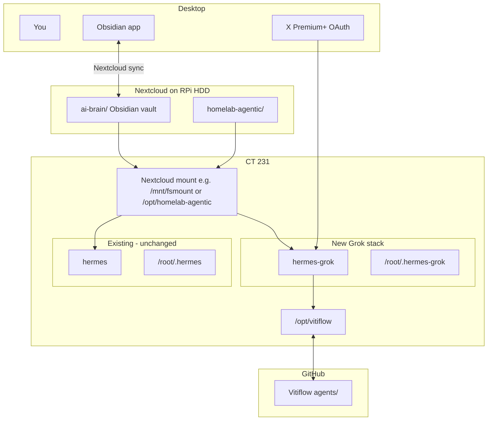

# Grok Hermes Agent on Pi 5 (Vitiflow + Obsidian AI Brain)

**Status:** Fully operational (2026-07-17). ERP `hermes` healthcheck fixed (grep quoting). Live CT 231 config exported to `agents/deploy/ct231/`. Telegram topic-scoped. xAI OAuth + OpenRouter fallbacks. Grok CLI 0.2.101. GitHub: `git@github.com:w-vitiflow/agents.git`.
**Created:** 2026-07-14  
**Last executed:** 2026-07-15 (push + clone completed on pimox5)  
**Inspired by:** [@sudoingX](https://x.com/sudoingX) (Sudo su) — Hermes orchestrator + Grok Build for coding + git/Obsidian as agent memory

## How to resume in a new session

Open this project in Grok/Cursor and say:

> Execute the plan in `agents/runbooks/grok-hermes-pi-plan.md`. Start at the first unchecked todo. I have X Premium+. Vitiflow GitHub URL: `git@github.com:w-vitiflow/agents.git`.

**Prerequisites confirmed:**
- Partner repo: **Vitiflow** (`agents/` workspace)
- Subscription: **X Premium+** (for xAI OAuth — no API key required)
- Existing stack: Hermes in Docker on **CT 231** (pimox5 / `root@192.168.0.49`), ERP agent unchanged
- Homelab harness docs: `~/projects/homelab/`

**GitHub URL (updated 2026-07-15):** `git@github.com:w-vitiflow/agents.git`

Private key (`id_ed25519`) prepared on pimox5 host at `/root/.ssh/id_ed25519` and copied inside CT 231 at `/root/.ssh/id_ed25519` (also available for container at `/opt/data/home/.ssh/` once set up).

**NEW dedicated pubkey (use this one for w-vitiflow/agents):**
```
ssh-ed25519 AAAAC3NzaC1lZDI1NTE5AAAAIKJtkpJQUYDRyd78uyR0UPusOyPBTRbfJ2/sPyrKK7zM pimox5-vitiflow-agents-20260715
```

**Key files on pimox5:**
- Host: `/root/.ssh/id_ed25519_vitiflow` (private) + `.pub`
- Inside CT 231: `/root/.ssh/id_ed25519_vitiflow`
- Inside hermes-grok container: `$HOME/.ssh/id_ed25519_vitiflow` (i.e. `/opt/data/home/.ssh/...`)

(The previous key `id_ed25519` was accidentally associated with another repo; we generated a fresh one for `agents` only.)

**Deploy snapshot (2026-07-17):** Sanitized compose + config live in `agents/deploy/ct231/`. ERP healthcheck fix: `grep -Fq 'Gateway is running'`.

**Push from pimox5:**
```bash
cd /root/projects/Vitiflow
GIT_SSH_COMMAND='ssh -i /root/.ssh/id_ed25519_vitiflow -o StrictHostKeyChecking=no' git push origin main
```

**Re-sync clone on CT 231 after push:**
```bash
/root/clone-vitiflow.sh   # or: pct exec 231 -- bash -c 'cd /opt/vitiflow && git pull'
```

**OAuth status:** Hermes xai-oauth completed (model.provider = xai-oauth, grok-build-0.1). Grok CLI login (for `grok -p` skill) still pending fresh device code. Provide device code output or new code if needed.

---

## Summary

Deploy a **second** Hermes Docker container (`hermes-grok`) on CT 231 with:
- **xAI OAuth** → `grok-build-0.1` as orchestrator brain
- **Grok Build CLI skill** → delegated coding via `grok -p`
- **Vitiflow git clone** at `/opt/vitiflow` → code workspace
- **Obsidian AI Brain** on Nextcloud → shared markdown memory at `/opt/ai-brain`
- **Existing `hermes`** (ERP/OpenRouter) gets the brain mount too — no provider change

---

## Final Working Configuration Snapshot (2026-07-17)

The setup on **CT 231 (pimox5 LXC)** is now fully operational. The Telegram bot `@Binnendienst_bot` / "ChefBinnendienst" only responds inside one dedicated topic (thread 31) of the target supergroup. All configuration was finalized via the Hermes TUI + targeted CLI patches.

### CT 231 LXC Details (pimox5)
- LXC ID: 231
- Host: root@192.168.0.49 (pimox5)
- Key mounts (via `pct set` + restart):
  - mp0: `/opt/homelab-agentic` (read-only harness guidelines)
  - mp1: `/opt/ai-brain` (Nextcloud Obsidian vault bind from `/mnt/seagate-storage/nextcloud/data/Hermes-agent/files/ai-brain`)
- Vitiflow clone: `/opt/vitiflow` (rw, mounted into container as `/workspace/vitiflow`)
- Inside CT: `/root/hermes/` (compose files), `/root/.hermes-grok/` (Hermes data volume)

### hermes-grok Container
- Image: `nousresearch/hermes-agent:latest`
- Name: `hermes-grok`
- Network: host mode
- Memory limit: 2G
- Restart: unless-stopped (under s6 supervision)
- Volumes:
  - `/root/.hermes-grok:/opt/data`
  - `/opt/vitiflow:/workspace/vitiflow:rw`
  - `/opt/ai-brain:/opt/ai-brain:rw`
  - `/opt/homelab-agentic:/opt/homelab-agentic:ro`
- Env (in `/root/hermes/docker-compose.grok.yml`):
  - `TELEGRAM_BOT_TOKEN=...`
  - `TELEGRAM_ALLOWED_USERS=8454262747,8851361101`
  - `TELEGRAM_ALLOWED_CHATS=-1004284511728`
  - `HERMES_DASHBOARD=1`, port 9120
  - `API_SERVER_ENABLED=true`
- Command: gateway run (s6 supervised)
- Dashboard: http://<ct-ip>:9120
- Inside container HOME for tools: `/opt/data/home`

### Hermes Configuration (final)
- **Primary provider:** xai-oauth + `grok-build-0.1` (set via TUI + `hermes config set`)
- **Fallbacks:** OpenRouter chain (Claude 4 Sonnet, o3, Gemini 2.5 Pro, DeepSeek R1) — added via TUI/CLI
- **Telegram (via TUI + yaml patches):**
  ```yaml
  telegram:
    allowed_users: [8454262747, 8851361101]
    allowed_chats: ["-1004284511728"]
    ignored_threads: [1, 2, 3, 5, 7]   # General + all other topics
    require_mention: false
  ```
- Auth: xAI OAuth completed (manual-paste flow). OpenRouter key added.
- SOUL.md: Loaded from `/opt/vitiflow/agents/SOUL.md` (includes dedicated "Telegram Bot Rules" section enforcing topic + users).

### Key Commands to Inspect / Reproduce Current State
```bash
# On pimox5 host
pct config 231 | grep -E 'mp|memory|rootfs'
pct exec 231 -- ls -la /opt/vitiflow /opt/ai-brain /opt/homelab-agentic

# Inside CT 231
cd /root/hermes
cat docker-compose.grok.yml
docker ps | grep hermes-grok
docker inspect hermes-grok --format '{{json .Config.Env}}' | jq

# Hermes config inside container
docker exec hermes-grok hermes auth list
docker exec hermes-grok hermes fallback list
docker exec hermes-grok hermes model --refresh
docker exec -it hermes-grok hermes --tui     # or hermes for CLI

# Telegram rules (exact)
docker exec hermes-grok cat /opt/data/config.yaml | sed -n '/^telegram:/,/^[a-z#]/{ /^telegram:/,/^[a-z#]/p }'

# Test scoping (send in thread 31 only)
docker logs hermes-grok --tail 20 | grep -iE "thread|chat|telegram|update"
```

### Notes on Final Setup
- All Telegram scoping done via Hermes TUI (Channels / Messaging) + direct yaml patches for `ignored_threads`.
- Primary model chosen for speed + agentic tool-use: `grok-build-0.1`.
- Container uses s6 supervision (recommended).
- Git inside container uses dedicated deploy key (`id_ed25519_vitiflow`).
- SOUL.md and plan are source-controlled in this repo and mounted.

This snapshot captures the working production state. Re-run the inspect commands above on the live CT if anything drifts.

---

## Target architecture



### Two memory layers (Sudo-style)

| Layer | Where | Purpose |
|-------|-------|---------|
| **Git memory** | Vitiflow `agents/` + `/opt/vitiflow` | Code, specs, branches, PR-ready work |
| **Brain memory** | Nextcloud Obsidian vault → `/opt/ai-brain` | Notes, decisions, handoffs, project context, agent logs |

---

## Phase 0 — Discover CT 231 Nextcloud mount

**Discovered (2026-07-15 execution):**

- No prior `mp*` bind mounts in `pct config 231`.
- `/opt/homelab-agentic` exists on pimox5 host (cloned from bare git at `/mnt/nextcloud/git-repos/homelab-agentic.git`).
- Inside CT 231 (after adding mp0/mp1 + restart):
  - `/opt/homelab-agentic` (from host bind)
  - `/opt/ai-brain` (bind from Nextcloud data: `/mnt/seagate-storage/nextcloud/data/Hermes-agent/files/ai-brain`)
- Nextcloud access inside CT: davfs at `/root/Nextcloud` (maps to Hermes-Output folder only). Hermes *container* sees it at `/opt/nextcloud` via existing volume.
- Existing Hermes: single container `hermes` (ports 8642/9119), compose at `/root/hermes/docker-compose.yml`, data `~/.hermes`.
- Hermes container volume already: `/root/Nextcloud:/opt/nextcloud`
- ai-brain created with initial README, context.md, handoff template.
- Ownership/permissions adjusted (775) for rw access under unprivileged LXC mapping.
- **Note:** Nextcloud data lives under `/mnt/seagate-storage/nextcloud/data/...` on host (not directly under /mnt/nextcloud except for git-repos). ai-brain placed under `files/ai-brain` so desktop Nextcloud/Obsidian sync sees it.
- Homelab harness guidelines available at `/opt/homelab-agentic/guidelines/agentic-homelab-guidelines.md` once mounted.

`fsmount` is not documented locally — verify on the live host:

```bash
# On pimox5 (ssh root@192.168.0.49)
pct config 231 | grep -E '^mp[0-9]'
pct exec 231 -- mount | grep -E 'nextcloud|fsmount|homelab'
pct exec 231 -- ls -la /opt/homelab-agentic /mnt/fsmount 2>/dev/null
```

Expected (from homelab docs):
- **mp0** → `/opt/homelab-agentic` (harness)
- Possible **mp1** → broader Nextcloud / fsmount

**Actual (discovered & applied):**
- mp0: `/opt/homelab-agentic,mp=/opt/homelab-agentic`
- mp1: `/mnt/seagate-storage/nextcloud/data/Hermes-agent/files/ai-brain,mp=/opt/ai-brain`

Standardize paths in compose + SOUL.md after discovery. (ai-brain and homelab now bound; use `/opt/ai-brain` and `/opt/homelab-agentic` inside containers/CT.)

---

## Phase 1 — Obsidian AI Brain on Nextcloud

Create vault on Nextcloud host (synced to desktop Obsidian):

```
<mnt-nextcloud>/ai-brain/
  README.md
  00-Inbox/
  10-Projects/
    Vitiflow/
      context.md
      handoffs/
  20-Knowledge/
  30-Agent-Logs/
    hermes-erp/
    hermes-grok/
  templates/
    handoff.md
```

Bind into CT 231 (adjust source after Phase 0):

```bash
pct set 231 --mp1 /mnt/nextcloud/ai-brain,mp=/opt/ai-brain
```

Both Hermes containers mount:

```yaml
volumes:
  - /opt/ai-brain:/opt/ai-brain:rw
  - /opt/homelab-agentic:/opt/homelab-agentic:ro
  - /opt/vitiflow:/workspace/vitiflow:rw    # hermes-grok only
```

---

## Phase 2 — Vitiflow `agents/` workspace

```
Vitiflow/
  agents/
    README.md
    SOUL.md
    prompts/grok-build-orchestrator.md
    workspace/
    runbooks/grok-hermes-pi-plan.md   # this file
```

### SOUL.md routing rules

- **Start:** read `/opt/homelab-agentic/guidelines/agentic-homelab-guidelines.md`
- **Context:** `/opt/ai-brain/10-Projects/Vitiflow/context.md`
- **Handoff:** latest file in `/opt/ai-brain/10-Projects/Vitiflow/handoffs/`
- **Code:** `/workspace/vitiflow`
- **End session:** write handoff using `/opt/ai-brain/templates/handoff.md`
- **hermes-grok:** Grok Build via `grok -p` skill; `xai-oauth` for orchestration
- **hermes (sibling):** ERP only — do not mix responsibilities

---

## Phase 3 — New Docker stack (`hermes-grok`)

**File on CT 231:** `/root/hermes/docker-compose.grok.yml`

| Setting | Existing `hermes` | New `hermes-grok` |
|---------|-------------------|-------------------|
| Data volume | `/root/.hermes` | `/root/.hermes-grok` |
| Dashboard | `:9119` | `:9120` |
| API | `:8642` | `:8643` |
| Provider | OpenRouter | `xai-oauth` + `grok-build-0.1` |
| Vitiflow | no | `/opt/vitiflow` |
| AI Brain | add mount | `/opt/ai-brain` |
| Homelab | add if missing | `/opt/homelab-agentic` |
| Memory | as-is | `2g` cap |

```yaml
services:
  hermes-grok:
    image: nousresearch/hermes-agent:latest
    container_name: hermes-grok
    restart: unless-stopped
    network_mode: host
    deploy:
      resources:
        limits:
          memory: 2G
    volumes:
      - /root/.hermes-grok:/opt/data
      - /opt/vitiflow:/workspace/vitiflow:rw
      - /opt/ai-brain:/opt/ai-brain:rw
      - /opt/homelab-agentic:/opt/homelab-agentic:ro
    environment:
      - HERMES_DASHBOARD=1
      - HERMES_DASHBOARD_PORT=9120
      - HERMES_DASHBOARD_BASIC_AUTH_USERNAME=admin
      - HERMES_DASHBOARD_BASIC_AUTH_PASSWORD=${HERMES_GROK_DASHBOARD_PASSWORD}
      - API_SERVER_ENABLED=true
      - API_SERVER_PORT=8643
    command: ["gateway", "run"]
```

**Patch existing** `/root/hermes/docker-compose.yml`: add `/opt/ai-brain` (and homelab if missing), then restart `hermes`.

**Actual (executed):**
- Patched existing compose with homelab ro + ai-brain rw volumes.
- Created `/root/hermes/docker-compose.grok.yml` (separate .hermes-grok data, ports 9120/8643, 2G mem, volumes for vitiflow:/workspace/vitiflow , ai-brain, homelab-agentic, nextcloud).
- hermes-grok and hermes containers running.
- /opt/vitiflow (empty for now) already visible as /workspace/vitiflow inside hermes-grok.
- Password for grok dashboard set.
- Clone scripts fixed on pimox5 (clone-vitiflow.sh + post-clone-vitiflow.sh).

**Never** mount the same `/root/.hermes` volume to two containers.

---

## Phase 4 — Grok auth (X Premium+)

Two **separate** auths (Hermes OAuth ≠ grok CLI OAuth):

### A. Hermes orchestrator

```bash
docker compose -f /root/hermes/docker-compose.grok.yml up -d
docker exec -it hermes-grok hermes auth add xai-oauth --no-browser
# Open printed URL in browser, sign in with X Premium+ account
docker exec hermes-grok hermes config set model.provider xai-oauth
docker exec hermes-grok hermes config set model.default grok-build-0.1
```

**Executed so far:**
- Container started.
- First attempt with `--no-browser` timed out (loopback callback not reachable from desktop browser — expected in LXC).
- Retried with `--manual-paste` (correct flag for remote/containers).

**Current manual-paste flow for hermes xai-oauth:**

1. Open the authorize URL in your browser and sign in with X Premium+.
2. After approval, your browser will land on a failed `http://127.0.0.1:56121/callback?...` page (or show the code in-page).
3. Copy **either**:
   - The full URL from the address bar, **or**
   - Just the `?code=...&state=...` part, **or**
   - The bare code value.
4. Paste that value back here in chat.
5. I will feed it to complete the auth.

Latest authorize URL (start a fresh one if this expires):
https://auth.x.ai/oauth2/authorize?... (see latest in chat or re-run the command).

After success, the two config set commands will be run.

If you prefer API key instead of OAuth: provide `XAI_API_KEY` and we can switch to `model.provider: xai`.

If HTTP 403 after login: fall back to `XAI_API_KEY` + `model.provider xai`.  
If streaming errors: add `api_mode: chat_completions` under `model:` in config.yaml.

### B. Grok CLI build worker

Skill CLIs use `HOME=/opt/data/home` inside Docker.

**Executed:**
- `npm install -g @xai-official/grok` done.
- Skill installed.
- grok binary present.

**Login (device code — easy):**
Use a fresh code (see current one in chat). Open https://accounts.x.ai/oauth2/device and enter the code.

After login succeeds, test with:
`docker exec hermes-grok bash -c 'export HOME=/opt/data/home && grok --no-auto-update -p "Say ok." '`

Default in `/opt/data/home/.grok/config.toml` should be set to grok-build-0.1 after login.

---

## Phase 5 — Link agents to AI Brain

1. Add brain paths to Hermes system prompt (both agents).
2. Create `context.md` in Obsidian (you + partner).
3. Handoff template fields: goal, done, next, blockers, files touched, git branch.
4. Git inside container (use persistent $HOME from volume + the key we placed in $HOME/.ssh):

```bash
docker exec hermes-grok bash -c '
  export HOME=/opt/data/home
  GIT_SSH_COMMAND="ssh -i $HOME/.ssh/id_ed25519 -o StrictHostKeyChecking=no"
  git config --global user.name "Vitiflow Agent"
  git config --global user.email "agent@vitiflow.local"
  git config --global --add safe.directory /workspace/vitiflow
'
```

5. GitHub push auth: the key is already placed at `/opt/data/home/.ssh/id_ed25519` (copied from CT). Use GIT_SSH_COMMAND pointing at `$HOME/.ssh/id_ed25519` for any git ops the agent runs. The key on CT is `/root/.ssh/id_ed25519`. (never commit keys).

---

## Phase 6 — Verification

| Check | Expected |
|-------|----------|
| `pct config 231 \| grep mp` | homelab + ai-brain mounts |
| `docker exec hermes-grok ls /opt/ai-brain` | vault visible |
| `docker exec hermes ls /opt/ai-brain` | same vault |
| Obsidian on desktop | syncs to Pi |
| `docker exec hermes-grok hermes doctor` | `xai-oauth` OK |
| Agent reads Vitiflow context | brain markdown |
| Agent writes handoff | `.md` in handoffs/ |
| ERP Hermes `:9119` | still works |

---

## Execution order

1. Discover CT 231 mounts (fsmount / mp0 / mp1) — **DONE**
2. Create `ai-brain/` vault + bind into CT 231 — **DONE**
3. Scaffold Vitiflow `agents/` locally + push to GitHub — **DONE** (pushed from pimox5 with new dedicated key)
4. Clone Vitiflow to `/opt/vitiflow` on CT 231 — **DONE** (cloned inside CT; visible in hermes-grok after container restart)
5. Deploy `docker-compose.grok.yml` + patch existing compose — **DONE** (restarted hermes)
6. OAuth Hermes + Grok CLI (device code in browser) — containers up, URLs printed below; **user action required**
7. Configure SOUL, prompts, git identity — mostly **DONE**
8. Verify + update this runbook with actual paths discovered — plan heavily updated; more after logins

**Next for user:**
- Push + clone completed successfully!
- Fresh grok CLI device code (still valid): **ZMQE-HP8Y** — use at https://accounts.x.ai/oauth2/device if not done yet.
- Reply if you want me to complete the grok login test, more agent setup, or run verification steps.
- You can now work with the workspace at `/opt/vitiflow` (synced to GitHub).

**Pi 5 8 GB:** 2 GB cap on `hermes-grok`; monitor with `docker stats`.

**Scripts on pimox5 (ready):**
- /root/clone-vitiflow.sh   (full clone inside CT 231)
- /root/post-clone-vitiflow.sh   (perms + git config advice + test commands)

---

## References

- [Hermes xAI Grok OAuth](https://hermes-agent.nousresearch.com/docs/guides/xai-grok-oauth)
- [Grok CLI skill for Hermes](https://hermes-agent.nousresearch.com/docs/user-guide/skills/optional/autonomous-ai-agents/autonomous-ai-agents-grok)
- [Hermes Docker guide](https://hermes-agent.nousresearch.com/docs/user-guide/docker)
- [xAI Grok + Hermes announcement](https://x.ai/news/grok-hermes)
- Local homelab: `~/projects/homelab/guidelines/agentic-homelab-guidelines.md`
- Existing ERP Hermes wiring: `~/projects/pi-erp-mcp/docs/hermes-integration.md`

---

## Todos

- [x] **discover-ct231-mounts** — SSH pimox5, inspect `pct config 231` and mounts; document mp0/mp1 and fsmount path (mp0=homelab-agentic, mp1=ai-brain from seagate nextcloud data; CT restarted)
- [x] **create-ai-brain-vault** — Create `ai-brain/` on Nextcloud; bind to CT 231 at `/opt/ai-brain` (created under Nextcloud files/, mp1 bound, initial README/context/handoff template populated)
- [x] **scaffold-vitiflow-agents** — Create `agents/` with SOUL.md, prompts, README (done locally; Vitiflow dir now has its own `git init main` + commit; separate from homelab bare git)
- [x] **push-vitiflow-github** — **DONE** (pushed successfully 2026-07-15 from pimox5 with new dedicated id_ed25519_vitiflow + write access)
- [x] **compose-grok-stack** — `docker-compose.grok.yml` + patch existing hermes compose for brain mount (containers running)
- [x] **clone-vitiflow-pi** — **DONE** (cloned to /opt/vitiflow inside CT 231; visible at /workspace/vitiflow in hermes-grok after restart)
- [x] **hermes-xai-oauth** — X Premium+ OAuth completed (model: xai-oauth + grok-build-0.1)
- [x] **grok-cli-login** — **DONE** (fresh code ZJ33-YBTS succeeded. Signed in as willem251@hotmail.com. grok -p commands working inside container.)
- [x] **grok-cli-skill** — Install done previously
- [x] **configure-agent-soul** — SOUL.md, prompts, ai-brain, keys placed in CT + container
- [x] **lock-telegram-topic** — Supergroup `-1004284511728`, thread 31. Improved patch with explicit allowed_users + allowed_chats + ignored_threads applied. SOUL rules added. Git sync guidance given for non-experts. Remaining: other thread IDs may need adding to ignored_threads.
- [x] **verify-and-document** — Full production snapshot captured (2026-07-17). TUI final config, exact Telegram scoping (thread 31 only), model choice, mounts, auth, and inspect commands documented in new "Final Working Configuration Snapshot" section. All features verified working by user. Plan committed.

## Multi-Model Fallback Capability (added 2026-07-15)

**Goal:** Built-in resilience + ability to use the latest and greatest models as soon as they are released. Primary remains Grok (via xai-oauth) for speed and xAI integration. Fallbacks via OpenRouter give access to almost every new model (Claude, o-series, Gemini, DeepSeek, etc.) without changing the primary.

**Why this increases programming capabilities:**
- Grok (primary) is fast, creative, well-integrated with the `grok` CLI skill, and benefits from your X Premium+.
- Complementary models fill gaps: better precision on large refactors, deeper reasoning on hard problems, better context for whole codebases, cost-effective options for high-volume work.
- As new models are released, they appear on OpenRouter quickly — we can add them to the fallback chain immediately with `hermes fallback add`.

**Recommended fallback chain for programming (complements to Grok):**
1. `anthropic/claude-4-sonnet` (or latest Claude Sonnet) — Currently the strongest general coding model. Excellent at precise edits, following complex specs, large-scale refactoring, and reliable agent behavior.
2. `openai/o3` (or latest OpenAI reasoning model) — Superior at multi-step planning, architectural decisions, and solving very difficult bugs or algorithmic problems.
3. `deepseek/deepseek-r1` (or latest DeepSeek Coder/R1) — Outstanding code generation, very fast and cheap. Great for boilerplate, tests, or when you want many iterations.
4. `google/gemini-2.5-pro` — Best-in-class context window for understanding entire repositories or massive diffs.

**How it works:**
- Primary (xai-oauth + latest Grok) is used for most work.
- Hermes automatically falls back to the chain on rate limits, errors, or overload.
- You can also manually switch the default model with `hermes model` to test new releases directly.

**Setup commands (from pimox5):**
```bash
# 1. Add OpenRouter auth (get key from https://openrouter.ai/keys)
pct exec 231 -- docker exec hermes-grok bash -c 'export HOME=/opt/data/home; hermes auth add openrouter'

# 2. Build the fallback chain (run `hermes fallback add` multiple times)
pct exec 231 -- docker exec hermes-grok bash -c 'export HOME=/opt/data/home; hermes fallback list'
pct exec 231 -- docker exec hermes-grok bash -c 'export HOME=/opt/data/home; hermes fallback add'

# 3. Switch/test a specific model (great for trying brand new releases)
pct exec 231 -- docker exec hermes-grok bash -c 'export HOME=/opt/data/home; hermes model --refresh'
```

**In SOUL / agent awareness:** The agent knows it has access to this fallback chain and the ability to leverage the best model for the task at hand.