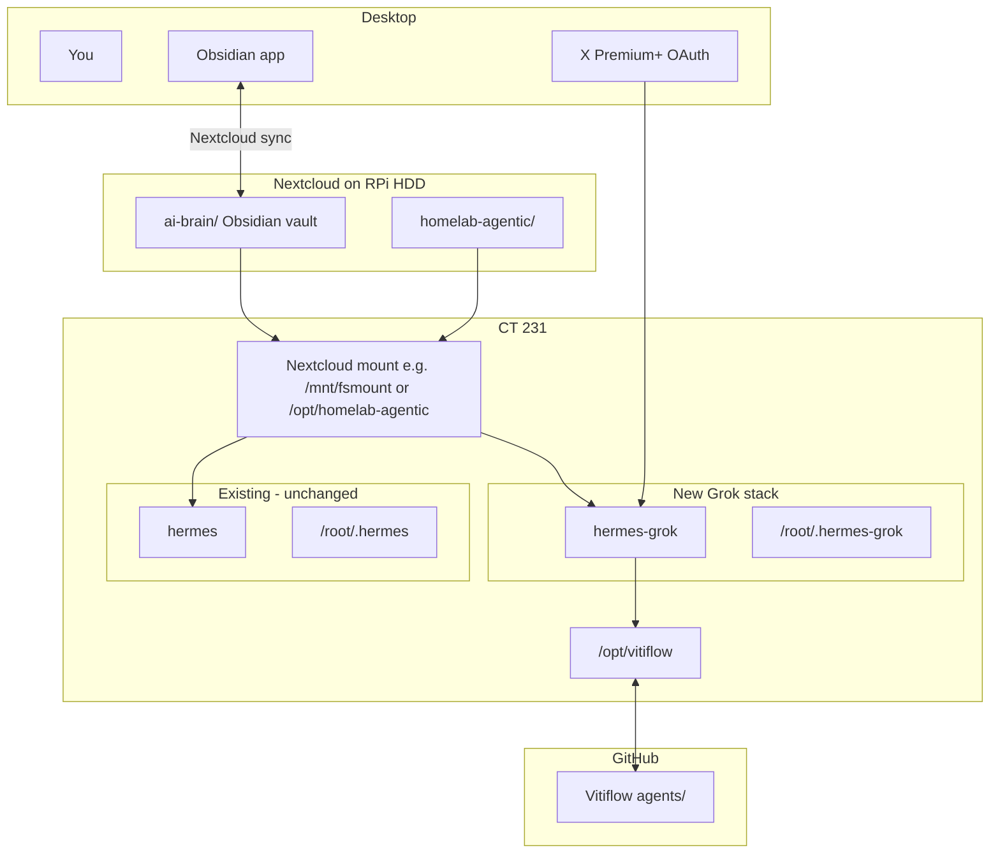

# Grok Hermes Agent on Pi 5 (Vitiflow + Obsidian AI Brain)

**Status:** In progress — Phase 0-3 complete (discovery, ai-brain, scaffold, compose, bootstrap clone); OAuth logins pending browser steps (see below)
**Created:** 2026-07-14  
**Last executed:** 2026-07-15 (this session)  
**Inspired by:** [@sudoingX](https://x.com/sudoingX) (Sudo su) — Hermes orchestrator + Grok Build for coding + git/Obsidian as agent memory

## How to resume in a new session

Open this project in Grok/Cursor and say:

> Execute the plan in `agents/runbooks/grok-hermes-pi-plan.md`. Start at the first unchecked todo. I have X Premium+. Vitiflow GitHub URL: `git@github.com:VitiFlow-B-V/agents.git`.

**Prerequisites confirmed:**
- Partner repo: **Vitiflow** (`agents/` workspace)
- Subscription: **X Premium+** (for xAI OAuth — no API key required)
- Existing stack: Hermes in Docker on **CT 231** (pimox5 / `root@192.168.0.49`), ERP agent unchanged
- Homelab harness docs: `~/projects/homelab/`

**GitHub URL (provided):** `git@github.com:VitiFlow-B-V/agents.git` — now being wired up.

**OAuth status:** See Phase 4. The loopback timed out. We are using `--manual-paste`. Provide the callback value from the browser here in chat when ready.

---

## Summary

Deploy a **second** Hermes Docker container (`hermes-grok`) on CT 231 with:
- **xAI OAuth** → `grok-build-0.1` as orchestrator brain
- **Grok Build CLI skill** → delegated coding via `grok -p`
- **Vitiflow git clone** at `/opt/vitiflow` → code workspace
- **Obsidian AI Brain** on Nextcloud → shared markdown memory at `/opt/ai-brain`
- **Existing `hermes`** (ERP/OpenRouter) gets the brain mount too — no provider change

---

## Target architecture



### Two memory layers (Sudo-style)

| Layer | Where | Purpose |
|-------|-------|---------|
| **Git memory** | Vitiflow `agents/` + `/opt/vitiflow` | Code, specs, branches, PR-ready work |
| **Brain memory** | Nextcloud Obsidian vault → `/opt/ai-brain` | Notes, decisions, handoffs, project context, agent logs |

---

## Phase 0 — Discover CT 231 Nextcloud mount

**Discovered (2026-07-15 execution):**

- No prior `mp*` bind mounts in `pct config 231`.
- `/opt/homelab-agentic` exists on pimox5 host (cloned from bare git at `/mnt/nextcloud/git-repos/homelab-agentic.git`).
- Inside CT 231 (after adding mp0/mp1 + restart):
  - `/opt/homelab-agentic` (from host bind)
  - `/opt/ai-brain` (bind from Nextcloud data: `/mnt/seagate-storage/nextcloud/data/Hermes-agent/files/ai-brain`)
- Nextcloud access inside CT: davfs at `/root/Nextcloud` (maps to Hermes-Output folder only). Hermes *container* sees it at `/opt/nextcloud` via existing volume.
- Existing Hermes: single container `hermes` (ports 8642/9119), compose at `/root/hermes/docker-compose.yml`, data `~/.hermes`.
- Hermes container volume already: `/root/Nextcloud:/opt/nextcloud`
- ai-brain created with initial README, context.md, handoff template.
- Ownership/permissions adjusted (775) for rw access under unprivileged LXC mapping.
- **Note:** Nextcloud data lives under `/mnt/seagate-storage/nextcloud/data/...` on host (not directly under /mnt/nextcloud except for git-repos). ai-brain placed under `files/ai-brain` so desktop Nextcloud/Obsidian sync sees it.
- Homelab harness guidelines available at `/opt/homelab-agentic/guidelines/agentic-homelab-guidelines.md` once mounted.

`fsmount` is not documented locally — verify on the live host:

```bash
# On pimox5 (ssh root@192.168.0.49)
pct config 231 | grep -E '^mp[0-9]'
pct exec 231 -- mount | grep -E 'nextcloud|fsmount|homelab'
pct exec 231 -- ls -la /opt/homelab-agentic /mnt/fsmount 2>/dev/null
```

Expected (from homelab docs):
- **mp0** → `/opt/homelab-agentic` (harness)
- Possible **mp1** → broader Nextcloud / fsmount

**Actual (discovered & applied):**
- mp0: `/opt/homelab-agentic,mp=/opt/homelab-agentic`
- mp1: `/mnt/seagate-storage/nextcloud/data/Hermes-agent/files/ai-brain,mp=/opt/ai-brain`

Standardize paths in compose + SOUL.md after discovery. (ai-brain and homelab now bound; use `/opt/ai-brain` and `/opt/homelab-agentic` inside containers/CT.)

---

## Phase 1 — Obsidian AI Brain on Nextcloud

Create vault on Nextcloud host (synced to desktop Obsidian):

```
<mnt-nextcloud>/ai-brain/
  README.md
  00-Inbox/
  10-Projects/
    Vitiflow/
      context.md
      handoffs/
  20-Knowledge/
  30-Agent-Logs/
    hermes-erp/
    hermes-grok/
  templates/
    handoff.md
```

Bind into CT 231 (adjust source after Phase 0):

```bash
pct set 231 --mp1 /mnt/nextcloud/ai-brain,mp=/opt/ai-brain
```

Both Hermes containers mount:

```yaml
volumes:
  - /opt/ai-brain:/opt/ai-brain:rw
  - /opt/homelab-agentic:/opt/homelab-agentic:ro
  - /opt/vitiflow:/workspace/vitiflow:rw    # hermes-grok only
```

---

## Phase 2 — Vitiflow `agents/` workspace

```
Vitiflow/
  agents/
    README.md
    SOUL.md
    prompts/grok-build-orchestrator.md
    workspace/
    runbooks/grok-hermes-pi-plan.md   # this file
```

### SOUL.md routing rules

- **Start:** read `/opt/homelab-agentic/guidelines/agentic-homelab-guidelines.md`
- **Context:** `/opt/ai-brain/10-Projects/Vitiflow/context.md`
- **Handoff:** latest file in `/opt/ai-brain/10-Projects/Vitiflow/handoffs/`
- **Code:** `/workspace/vitiflow`
- **End session:** write handoff using `/opt/ai-brain/templates/handoff.md`
- **hermes-grok:** Grok Build via `grok -p` skill; `xai-oauth` for orchestration
- **hermes (sibling):** ERP only — do not mix responsibilities

---

## Phase 3 — New Docker stack (`hermes-grok`)

**File on CT 231:** `/root/hermes/docker-compose.grok.yml`

| Setting | Existing `hermes` | New `hermes-grok` |
|---------|-------------------|-------------------|
| Data volume | `/root/.hermes` | `/root/.hermes-grok` |
| Dashboard | `:9119` | `:9120` |
| API | `:8642` | `:8643` |
| Provider | OpenRouter | `xai-oauth` + `grok-build-0.1` |
| Vitiflow | no | `/opt/vitiflow` |
| AI Brain | add mount | `/opt/ai-brain` |
| Homelab | add if missing | `/opt/homelab-agentic` |
| Memory | as-is | `2g` cap |

```yaml
services:
  hermes-grok:
    image: nousresearch/hermes-agent:latest
    container_name: hermes-grok
    restart: unless-stopped
    network_mode: host
    deploy:
      resources:
        limits:
          memory: 2G
    volumes:
      - /root/.hermes-grok:/opt/data
      - /opt/vitiflow:/workspace/vitiflow:rw
      - /opt/ai-brain:/opt/ai-brain:rw
      - /opt/homelab-agentic:/opt/homelab-agentic:ro
    environment:
      - HERMES_DASHBOARD=1
      - HERMES_DASHBOARD_PORT=9120
      - HERMES_DASHBOARD_BASIC_AUTH_USERNAME=admin
      - HERMES_DASHBOARD_BASIC_AUTH_PASSWORD=${HERMES_GROK_DASHBOARD_PASSWORD}
      - API_SERVER_ENABLED=true
      - API_SERVER_PORT=8643
    command: ["gateway", "run"]
```

**Patch existing** `/root/hermes/docker-compose.yml`: add `/opt/ai-brain` (and homelab if missing), then restart `hermes`.

**Actual (executed):**
- Patched existing compose with homelab ro + ai-brain rw volumes.
- Created `/root/hermes/docker-compose.grok.yml` (separate .hermes-grok data, ports 9120/8643, 2G mem, all three volumes + vitiflow placeholder + nextcloud ro).
- Restarted existing `hermes` (volumes now active inside docker container at /opt/ai-brain and /opt/homelab-agentic).
- Password for grok dashboard added to .env as HERMES_GROK_DASHBOARD_PASSWORD.

**Never** mount the same `/root/.hermes` volume to two containers.

---

## Phase 4 — Grok auth (X Premium+)

Two **separate** auths (Hermes OAuth ≠ grok CLI OAuth):

### A. Hermes orchestrator

```bash
docker compose -f /root/hermes/docker-compose.grok.yml up -d
docker exec -it hermes-grok hermes auth add xai-oauth --no-browser
# Open printed URL in browser, sign in with X Premium+ account
docker exec hermes-grok hermes config set model.provider xai-oauth
docker exec hermes-grok hermes config set model.default grok-build-0.1
```

**Executed so far:**
- Container started.
- First attempt with `--no-browser` timed out (loopback callback not reachable from desktop browser — expected in LXC).
- Retried with `--manual-paste` (correct flag for remote/containers).

**Current manual-paste flow for hermes xai-oauth:**

1. Open the authorize URL in your browser and sign in with X Premium+.
2. After approval, your browser will land on a failed `http://127.0.0.1:56121/callback?...` page (or show the code in-page).
3. Copy **either**:
   - The full URL from the address bar, **or**
   - Just the `?code=...&state=...` part, **or**
   - The bare code value.
4. Paste that value back here in chat.
5. I will feed it to complete the auth.

Latest authorize URL (start a fresh one if this expires):
https://auth.x.ai/oauth2/authorize?... (see latest in chat or re-run the command).

After success, the two config set commands will be run.

If you prefer API key instead of OAuth: provide `XAI_API_KEY` and we can switch to `model.provider: xai`.

If HTTP 403 after login: fall back to `XAI_API_KEY` + `model.provider xai`.  
If streaming errors: add `api_mode: chat_completions` under `model:` in config.yaml.

### B. Grok CLI build worker

Skill CLIs use `HOME=/opt/data/home` inside Docker.

**Executed:**
- `npm install -g @xai-official/grok` done.
- Skill installed.
- grok binary present.

**Login (device code — easy):**
Use a fresh code (see current one in chat). Open https://accounts.x.ai/oauth2/device and enter the code.

After login succeeds, test with:
`docker exec hermes-grok bash -c 'export HOME=/opt/data/home && grok --no-auto-update -p "Say ok." '`

Default in `/opt/data/home/.grok/config.toml` should be set to grok-build-0.1 after login.

---

## Phase 5 — Link agents to AI Brain

1. Add brain paths to Hermes system prompt (both agents).
2. Create `context.md` in Obsidian (you + partner).
3. Handoff template fields: goal, done, next, blockers, files touched, git branch.
4. Git inside container:

```bash
docker exec hermes-grok bash -c '
  export HOME=/opt/data/home
  git config --global user.name "Vitiflow Agent"
  git config --global user.email "agent@vitiflow.local"
'
```

5. GitHub push auth: deploy key or PAT in `/opt/data/home/.ssh/` (never commit).

---

## Phase 6 — Verification

| Check | Expected |
|-------|----------|
| `pct config 231 \| grep mp` | homelab + ai-brain mounts |
| `docker exec hermes-grok ls /opt/ai-brain` | vault visible |
| `docker exec hermes ls /opt/ai-brain` | same vault |
| Obsidian on desktop | syncs to Pi |
| `docker exec hermes-grok hermes doctor` | `xai-oauth` OK |
| Agent reads Vitiflow context | brain markdown |
| Agent writes handoff | `.md` in handoffs/ |
| ERP Hermes `:9119` | still works |

---

## Execution order

1. Discover CT 231 mounts (fsmount / mp0 / mp1) — **DONE**
2. Create `ai-brain/` vault + bind into CT 231 — **DONE**
3. Scaffold Vitiflow `agents/` locally + push to GitHub — scaffold **DONE**, push pending URL
4. Clone Vitiflow to `/opt/vitiflow` on CT 231 — bootstrapped (real clone pending URL)
5. Deploy `docker-compose.grok.yml` + patch existing compose — **DONE** (restarted hermes)
6. OAuth Hermes + Grok CLI (device code in browser) — containers up, URLs printed below; **user action required**
7. Configure SOUL, prompts, git identity — mostly **DONE**
8. Verify + update this runbook with actual paths discovered — plan heavily updated; more after logins

**Next for user:**
- Complete the two browser OAuth flows (see Phase 4 section).
- Provide the Vitiflow GitHub URL so we can `git remote add` + push here, and do proper `git clone` on the Pi (overwriting the bootstrap).
- After auth success, run the `hermes config set` lines and test `grok -p` + handoff write.

**Pi 5 8 GB:** 2 GB cap on `hermes-grok`; monitor with `docker stats`.

---

## References

- [Hermes xAI Grok OAuth](https://hermes-agent.nousresearch.com/docs/guides/xai-grok-oauth)
- [Grok CLI skill for Hermes](https://hermes-agent.nousresearch.com/docs/user-guide/skills/optional/autonomous-ai-agents/autonomous-ai-agents-grok)
- [Hermes Docker guide](https://hermes-agent.nousresearch.com/docs/user-guide/docker)
- [xAI Grok + Hermes announcement](https://x.ai/news/grok-hermes)
- Local homelab: `~/projects/homelab/guidelines/agentic-homelab-guidelines.md`
- Existing ERP Hermes wiring: `~/projects/pi-erp-mcp/docs/hermes-integration.md`

---

## Todos

- [x] **discover-ct231-mounts** — SSH pimox5, inspect `pct config 231` and mounts; document mp0/mp1 and fsmount path (mp0=homelab-agentic, mp1=ai-brain from seagate nextcloud data; CT restarted)
- [x] **create-ai-brain-vault** — Create `ai-brain/` on Nextcloud; bind to CT 231 at `/opt/ai-brain` (created under Nextcloud files/, mp1 bound, initial README/context/handoff template populated)
- [x] **scaffold-vitiflow-agents** — Create `agents/` with SOUL.md, prompts, README (done locally; Vitiflow dir now has its own `git init main` + commit; separate from homelab bare git)
- [ ] **push-vitiflow-github** — Commit and push to partner Vitiflow repo (local repo initialized+committed with scaffold; **GitHub URL still needed** to `git remote add origin <URL> && git push -u origin main` then real clone on Pi)
- [x] **compose-grok-stack** — `docker-compose.grok.yml` + patch existing hermes compose for brain mount (files created on CT; existing hermes restarted with mounts)
- [x] **clone-vitiflow-pi** — Clone Vitiflow to `/opt/vitiflow` on CT 231 (bootstrapped via tar + git init placeholder at /opt/vitiflow; real `git clone <GitHub-URL>` needed when URL provided)
- [ ] **hermes-xai-oauth** — X Premium+ OAuth (loopback timed out; switched to --manual-paste flow. User must authorize in browser then provide the callback URL/code for paste-in)
- [x] **grok-cli-skill** — Install grok CLI, login, install skill (npm install -g done; skill installed after confirm; login device code pending browser)
- [x] **configure-agent-soul** — SOUL.md, brain rules, git config, deploy key (git identity set for /opt/data/home; SOUL and prompts scaffolded in repo)
- [ ] **verify-and-document** — Full checklist; update this file with discovered paths (plan.md extensively annotated with actual paths + execution notes; mounts verified inside CT and hermes container)